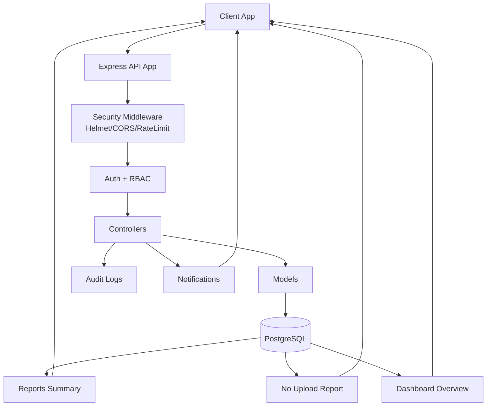

# CPDO Monitoring System - Backend System Flow

This document explains how the backend works end-to-end, from request entry to database updates and API responses.

---

## 1) High-Level Architecture

- **Framework:** Express.js
- **Database:** PostgreSQL (`pg` pool)
- **Auth:** JWT Access Token + Refresh Token rotation
- **Security:** Helmet, CORS, rate limiting, RBAC, audit logging
- **Validation:** Zod schemas
- **Error Handling:** Global async wrapper + centralized error middleware

Main boot files:
- `src/server.js` - server startup + DB health check
- `src/app.js` - middleware stack + route mounting
- `src/routes/index.js` - route groups under `/api/*`

---

## 2) Request Lifecycle (Per API Call)

1. Request enters Express app (`src/app.js`)
2. Global middleware executes:
   - Helmet
   - Compression
   - CORS
   - JSON parser + cookies
   - HTTP logging
3. Route matching under `/api/...`
4. Route-level middleware applies (as needed):
   - `requireAuth`
   - `requireRole(...)`
   - rate limiters
   - caching middleware
   - audit middleware
5. Controller handler runs (wrapped by `asyncHandler`)
6. Controller calls model layer (SQL queries)
7. Response returned as JSON
8. Any thrown async error is forwarded to centralized error handler

---

## 3) Authentication and Session Flow

### Login (`POST /api/auth/login`)
1. Validate input (email/password)
2. Find user + verify Argon2 hash
3. Create refresh token session in `auth_sessions` (hash stored)
4. Set refresh token cookie (`httpOnly`)
5. Return short-lived access token + user payload

### Refresh (`POST /api/auth/refresh`)
1. Read refresh cookie
2. Verify JWT signature and expiry
3. Verify session hash is active (not revoked/expired)
4. Revoke old session
5. Create new session + new refresh token (rotation)
6. Return new access token

### Logout (`POST /api/auth/logout`)
1. Read refresh cookie
2. Resolve session/user
3. Revoke all active sessions for that user
4. Clear refresh cookie
5. Return `{ ok: true }`

---

## 4) Authorization and Data Scoping

- `requireAuth` ensures caller has valid access token
- `requireRole` restricts endpoint access by role (`ADMIN`, `STAFF`, `OFFICE`)
- Office-level scoping is enforced in controllers:
  - `OFFICE` users can only access records from their own office

This protects sensitive data while still allowing admin/staff cross-office reporting.

---

## 5) Core Business Flow

### A) Templates and Checklist Setup
- Admin/staff create and manage governance templates and checklist items
- Data stored in:
  - `checklist_templates`
  - `checklist_items`

### B) Submission Creation
1. Office submits item evidence (submission metadata)
2. Submission row is upserted for `(year, office, checklist_item)`
3. Initial status is typically `PENDING`

### C) File Upload (Versioned)
1. Upload middleware validates type + size
2. Controller validates submission ownership/status
3. Quota check ensures user total storage stays below configured threshold
4. New file version inserted in `submission_files`
5. Older version flags updated (`is_current = false`, latest = true)

### D) Review Decision
1. Staff/admin review submission
2. Decision stored in `reviews`
3. Submission status updated (`APPROVED`, `DENIED`, `REVISION_REQUESTED`)
4. Notification can be created for the office user

### E) Comments
1. Authenticated user posts comment on a submission
2. Comment is sanitized server-side before insert
3. OFFICE role scope enforced
4. Author can delete own comments

---

## 6) Notifications Flow

- Notifications are stored in `notifications`
- APIs support:
  - unread list
  - paginated list
  - unread count
  - mark one read
  - mark all read

This supports both standard inbox UI and future real-time delivery (SSE/WebSocket).

---

## 7) Reports and Dashboard Flow

### Reports
- `GET /api/reports/summary`
  - Status breakdown by year (+ optional governance/office filters)
- `GET /api/reports/no-upload`
  - Missing expected checklist submissions for a target office/year

### Dashboard Overview
- `GET /api/dashboard/overview`
- Returns one payload for cards/charts/activity:
  - KPI cards (totals, pending, approved, denied, revisions, rates)
  - status breakdown chart data
  - monthly trend chart data
  - top governance areas
  - recent submissions
  - unread notifications
  - missing uploads count (when office scope is available)

---

## 8) Error Handling Strategy

- Every async route handler is wrapped by `asyncHandler`
- Any thrown/rejected error is passed to `errorHandler`
- Centralized handler logs error context and returns safe JSON response
- Server startup has guarded boot logic with fatal error logging and process exit

---

## 9) Database Integrity Model (Key Points)

- Foreign keys enforce relationship integrity
- Unique constraints prevent duplicates (e.g., template/year, submission key)
- Indexed filter fields improve report/query performance
- Session table (`auth_sessions`) supports secure token revocation/rotation
- Versioned upload table (`submission_files`) tracks evidence history

---

## 10) End-to-End Sequence (Simplified)

1. User logs in → receives access + refresh
2. User fetches templates/checklist context
3. User creates submission and uploads evidence
4. Staff/admin reviews and sets decision
5. Office gets notification and can comment/respond if revision requested
6. Dashboard and reports aggregate live DB state for monitoring

---

## 11) Mermaid Overview Diagram

---

## 12) Notes for Future Enhancements

- Add antivirus scan service in upload pipeline
- Add request timeout middleware
- Add real-time notifications (SSE) for instant dashboard updates
- Add report export workers (PDF/XLSX/CSV) via background queue
